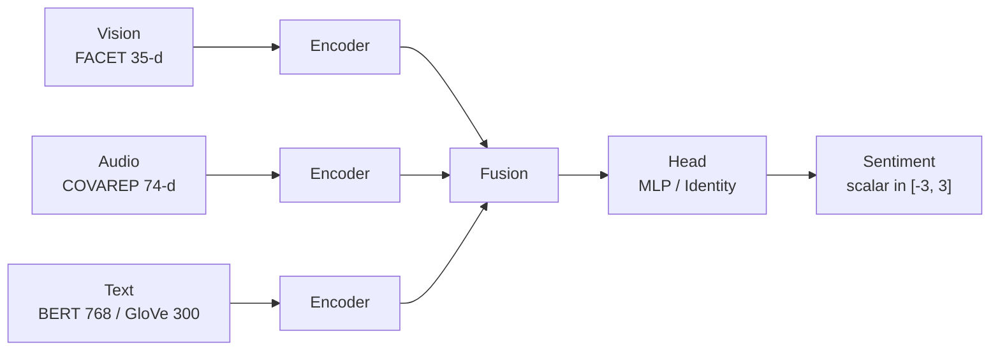

# Transformer-based Multimodal Sentiment Analysis

Personal research code for **multimodal sentiment regression** on
[CMU-MOSI](http://multicomp.cs.cmu.edu/resources/cmu-mosi-dataset/) and
[CMU-MOSEI](http://multicomp.cs.cmu.edu/resources/cmu-mosei-dataset/).
The project compares classical fusion baselines with transformer fusion and a
gated cross-modal transformer (GMTM) that I implemented in `model/models.py`.

This is a **personal** study repo (MIT license, © 2024 pang990801). It is not
affiliated with any employer.

**Short Chinese summary / 中文简介**

本仓库用视觉（FACET 4.2, 35 维）、声学（COVAREP, 74 维）和文本（BERT 768 维或
GloVe 300 维）三种模态，在 CMU-MOSEI / MOSI 上做情感强度回归（标签约在
`[-3, 3]`）。融合方式包括早期/晚期拼接、张量融合、低秩张量融合、Transformer
早期/晚期融合，以及带跨模态注意力、模态门控和注意力池化的
`GatedMultiTransfomerModel`。评测指标为 MAE、Pearson 相关、均匀分箱 Acc-7 /
Acc-5，以及去掉中性样本后的二分类 Acc-2 / F1。

---

## Why this repo exists

I wanted a single place to:

1. Re-run the usual MultiBench-style fusion stack (concat, TFN, LMF) on the
   same BERT and GloVe feature dumps.
2. Add transformer encoders at early-fusion and late-fusion positions.
3. Try a gated multi-transformer that lets every modality attend to every
   other modality, then pool over time.
4. Transfer the same MOSEI checkpoints to MOSI without retraining.

The training loop, metrics, and pickle loaders all live under `model/`.
Narrative documentation lives under `docs/`. CPU-only walkthroughs that do
**not** need the raw `.pkl` / `.csd` dumps live under `examples/`.

## Repository map

| Path | What it is |
| --- | --- |
| [`model/models.py`](model/models.py) | Encoders, fusion modules, GMTM |
| [`model/train_and_test.py`](model/train_and_test.py) | `MultiFramework`, `train()`, `test()`, affect metrics |
| [`model/data/get_dataloader.py`](model/data/get_dataloader.py) | MOSI / MOSEI pickle loaders and ablation zero-outs |
| [`model/train_main_bert.py`](model/train_main_bert.py) | MOSEI + BERT, six fusion methods |
| [`model/train_main_glove.py`](model/train_main_glove.py) | MOSEI + GloVe, six fusion methods |
| [`model/train_GMTM_bert.py`](model/train_GMTM_bert.py) | MOSEI GMTM / modality ablation (BERT) |
| [`model/train_GMTM_glove.py`](model/train_GMTM_glove.py) | MOSEI GMTM / modality ablation (GloVe) |
| [`model/mosi_test/`](model/mosi_test/) | Zero-shot MOSI evaluation of MOSEI checkpoints |
| [`model/results/`](model/results/) | Published CSV tables used by the docs |
| [`docs/`](docs/) | Architecture, data, training, metrics, results |
| [`examples/`](examples/) | Synthetic batches, forward passes, toy GMTM, plots |

A longer file-by-file tour is in [`docs/repository-map.md`](docs/repository-map.md).

## Architecture (one picture)



`MultiFramework` in `train_and_test.py` is the glue: a list of encoders, one
fusion module, and a regression head. Fusion is swapped without rewriting the
loop. See [`docs/architecture.md`](docs/architecture.md) and
[`docs/fusion-methods.md`](docs/fusion-methods.md).

## Headline results (MOSEI, BERT text)

Copied from [`model/results/main_results.csv`](model/results/main_results.csv)
and the GMTM row of [`model/results/ablation_results.csv`](model/results/ablation_results.csv).
Lower MAE is better; higher Acc / Corr / F1 is better.

| Fusion | MAE ↓ | Acc-7 ↑ | Acc-5 ↑ | Acc-2 ↑ | Corr ↑ | F1 ↑ |
| --- | ---: | ---: | ---: | ---: | ---: | ---: |
| ConcatEarly | 0.6178 | 0.4424 | 0.5221 | 0.8084 | 0.6652 | 0.8475 |
| ConcatLate | 0.6148 | 0.4508 | 0.5162 | 0.8084 | 0.6637 | 0.8460 |
| TensorFusion | 0.6022 | 0.4445 | 0.5256 | 0.8244 | 0.6776 | 0.8626 |
| LowRankTensorFusion | 0.5970 | 0.4585 | 0.5409 | 0.8305 | 0.6925 | 0.8638 |
| TransformerEarly | 0.6057 | 0.4514 | 0.5327 | 0.8206 | 0.6788 | 0.8604 |
| TransformerLate | 0.5846 | 0.4675 | 0.5460 | 0.8393 | 0.7041 | 0.8699 |
| **GMTM (text+audio+visual)** | **0.5640** | **0.4827** | **0.5561** | **0.8429** | **0.7255** | **0.8777** |

On this BERT-MOSEI split, late transformer fusion beat the tensor-fusion
family, and GMTM improved further. Text carries most of the signal; audio and
vision help only once text is present. Full tables and MOSI transfer numbers
are in [`docs/results.md`](docs/results.md) and
[`docs/ablation-study.md`](docs/ablation-study.md).

## Feature and label conventions

| Modality | Source | Width used here |
| --- | --- | ---: |
| Vision | FACET 4.2 facial action units | 35 |
| Audio | COVAREP | 74 |
| Text (BERT) | per-timestep BERT hidden state | 768 |
| Text (GloVe) | 840B / 300-d word vectors | 300 |

Sequences are truncated / padded to **50** steps. Labels are continuous
sentiment intensities, treated as regression with `L1Loss`. Acc-7 / Acc-5
come from **uniform** bins of `[-3, 3]` (see
[`docs/evaluation.md`](docs/evaluation.md)), not the classic MOSI uneven bins.

## Setup

```bash
# training stack (CUDA if your torch build has it)
python -m pip install -r requirements.txt

# CPU-only docs / examples
python -m pip install -r requirements-examples.txt
python -m pip install torch --index-url https://download.pytorch.org/whl/cpu
```

Pickle dumps are **not** in git (they are large). Expected locations after you
build or copy them:

```
model/data/MOSEI/mosei_raw_bert.pkl
model/data/MOSEI/mosei_raw_glove.pkl
model/data/MOSI/mosi_raw_bert.pkl
model/data/MOSI/mosi_raw_glove.pkl
```

How those files are produced from MMSDK `.csd` sequences is documented in
[`docs/datasets.md`](docs/datasets.md). Raw file names are listed in
[`model/data/readme.md`](model/data/readme.md).

## Train / test (needs the pickle dumps)

Run these from `model/` so the relative `data/` and `checkpoints/` paths
resolve.

```bash
cd model

# MOSEI BERT fusion sweep (writes main_results.csv)
python train_main_bert.py

# MOSEI GloVe fusion sweep
python train_main_glove.py

# GMTM + modality ablation (uncomment the train() call first)
python train_GMTM_bert.py
python train_GMTM_glove.py

# MOSI transfer of the saved MOSEI checkpoints
cd mosi_test
python train_mosi_bert.py
python mult_bert_mosi.py
```

Default optimization (from the scripts, not a hidden config file):

- optimizer: `AdamW`
- learning rate: `1e-4`
- weight decay: `0.01`
- objective: `L1Loss` (MAE)
- batch size: 32
- early stop: 7 bad validation epochs
- gradient clip: 8.0

YAML mirrors of those knobs live in [`examples/configs/`](examples/configs/).

## Examples (no MOSI / MOSEI dumps required)

```bash
# from the repo root
python examples/run_fusion_forward.py
python examples/run_gmtm_toy.py
python examples/run_metrics.py
python examples/run_results_table.py
python examples/plot_published_results.py
```

`run_gmtm_toy.py` trains GMTM for a few CPU epochs on a synthetic batch whose
label is a known function of the text stream, then checks that train loss
falls. Details: [`examples/README.md`](examples/README.md).

```bash
python -m pytest examples/tests -q
```

## Documentation index

| Doc | Contents |
| --- | --- |
| [docs/README.md](docs/README.md) | Reading order |
| [docs/architecture.md](docs/architecture.md) | `MultiFramework`, encoders, GMTM internals |
| [docs/fusion-methods.md](docs/fusion-methods.md) | Every fusion class and its tensor shapes |
| [docs/datasets.md](docs/datasets.md) | MOSI / MOSEI, pickle layout, alignment, ablation zeros |
| [docs/training.md](docs/training.md) | `train()` loop, packed vs max-pad, scripts |
| [docs/evaluation.md](docs/evaluation.md) | MAE, Corr, Acc-7/5/2, F1, uniform bins |
| [docs/hyperparameters.md](docs/hyperparameters.md) | Widths, heads, dropout, GMTM `HParams` |
| [docs/ablation-study.md](docs/ablation-study.md) | Leave-one-modality-out tables |
| [docs/results.md](docs/results.md) | All published CSVs, plus a short reading |
| [docs/reproducing-experiments.md](docs/reproducing-experiments.md) | Checklist to rebuild numbers |
| [docs/repository-map.md](docs/repository-map.md) | File-level comments |

## License

MIT. See [LICENSE](LICENSE).
